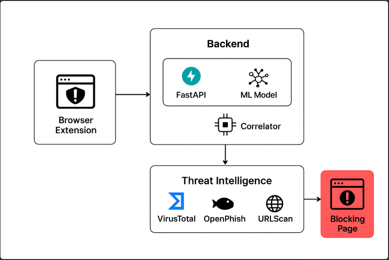

# **📝 Proyecto: Extensión de Navegador con Detección de Phishing en Tiempo Real**

---



---

## **1️⃣ Objetivo General**

Desarrollar una extensión de navegador que capture URLs en tiempo real, las envíe a un backend en Python, las analice con un **modelo de Machine Learning** y fuentes de **Threat Intelligence**, y determine si deben ser bloqueadas o permitidas.  
Incluye página de bloqueo personalizada, dashboard de métricas y logs estructurados tipo SIEM.

---

## **2️⃣ Estructura Final de Carpetas**

```bash
project/
├── backend/
│   ├── app/
│   │   ├── main.py              # Servidor Flask
│   │   ├── ml/
│   │   │   ├── model.pkl        # Modelo ML entrenado
│   │   │   ├── preprocess.py    # Feature engineering
│   │   │   └── predict.py       # Predicción ML
│   │   ├── services/
│   │   │   ├── virustotal.py    # Integración VT
│   │   │   ├── urlscan.py       # Integración URLScan
│   │   │   └── openphish.py     # Integración OpenPhish
│   │   └── utils/
│   │       ├── correlator.py    # Correlación de resultados
│   │       └── validators.py    # Validación de URLs
│   ├── metrics.py               # Métricas en memoria
│   └── requirements.txt
│
├── extension/
│   ├── manifest.json
│   ├── background.js            # Captura URLs y llama backend
│   ├── popup/
│   │   ├── popup.html           # Dashboard
│   │   ├── popup.js
│   │   └── popup.css
│   └── block/
│       ├── block.html           # Página de bloqueo
│       ├── block.js
│       └── block.css
│
└── README.md
```

---

## **3️⃣ Flujo de Datos Completo**

1. Usuario navega → extensión captura URL (`background.js`)
    
2. Envía URL a `backend/app/main.py` vía POST `/analyze`
    
3. Backend procesa:
    
    - Extrae features → ML (`predict.py`)
        
    - Consulta fuentes externas (VT, OpenPhish, URLScan)
        
    - Correlación con pesos y umbral → Score final
        
4. Devuelve JSON:
    

```json
{
  "url": "http://malicious.com",
  "score": 1.9,
  "block": true,
  "details": { "ml": {...}, "virustotal": {...}, "openphish": {...} }
}
```

5. Extensión:
    
    - `block=true` → redirige a `block/block.html`
        
    - `block=false` → permite navegación
        
6. Popup muestra métricas `/metrics` en tiempo real
    
7. Backend guarda logs estructurados en `events.log`
    

---

## **4️⃣ Backend (FastAPI)**

- **Endpoints principales**:
    
    - `/analyze` → recibe URL y devuelve veredicto
        
    - `/metrics` → devuelve métricas del sistema
        
- **Seguridad recomendada**:
    
    - HTTPS + API Keys
        
    - Validación de URLs
        
    - Rate limiting
        
    - CORS solo para extensión
        
- **Optimización**:
    
    - Caché para URLs ya analizadas
        
    - Consultas asíncronas a servicios externos
        
    - Logs JSON para integración SIEM
        

---

## **5️⃣ Modelo ML**

- Tipo: RandomForest / XGBoost / LightGBM
    
- Input: features de la URL (`preprocess.py`)
    
    - longitud URL, dominio, path
        
    - cantidad de `.` `-` `@`
        
    - parámetros `?`
        
    - HTTPS/IP
        
    - entropía del string
        
- Output:
    

```json
{"label": "phishing"|"benign", "score": 0.0-1.0}
```

- Guardado como `model.pkl` y cargado en `predict.py`
    
- Threshold configurable para decisión final
    

---

## **6️⃣ Correlación y Sistema de Pesos**

- Pesos sugeridos:
    
    - ML: 0.4
        
    - VirusTotal: 0.8
        
    - OpenPhish: 1.0
        
    - URLScan: 0.5
        
- Score total = sum(peso * indicador)
    
- Umbral recomendado: 1.3 → bloquear si score ≥ umbral
    

---

## **7️⃣ Extensión del Navegador**

- **background.js**: captura URLs y llama backend
    
- **block/block.html**: página de bloqueo profesional
    
- **popup/**: dashboard de métricas
    
- **Funciones avanzadas**:
    
    - Notificaciones opcionales
        
    - Continuar bajo riesgo
        
    - Estadísticas y logs en tiempo real
        

---

## **8️⃣ Logs y Métricas**

- Archivo `events.log` con JSON de cada URL analizada
    
- Métricas en memoria (`metrics.py`) para dashboard:
    
    - total URLs analizadas
        
    - bloqueadas / permitidas
        
    - detectadas por ML
        
    - alertas de Threat Intelligence
        

---

## **9️⃣ Recomendaciones para Producción**

- HTTPS, autenticación y rate limiting
    
- Caching de URLs y resultados
    
- Entrenamiento periódico del ML
    
- Dashboard y UX profesional
    
- Empaquetar extensión correctamente y minimizar JS/CSS
    
- Mantener API Keys seguros
    
- Pruebas extensas con URLs reales benignas y maliciosas
    

---

## **🔟 Checklist de Implementación**

|Paso|Estado|
|---|---|
|Estructura de carpetas|✅|
|Backend FastAPI|✅|
|Modelo ML entrenado y `predict.py`|✅|
|Integración con VT, OpenPhish, URLScan|✅|
|Correlación con pesos y umbral|✅|
|Página de bloqueo|✅|
|Dashboard de métricas|✅|
|Logs estructurados|✅|
|Seguridad básica backend|⚠ (Recomendado HTTPS/Keys)|
|Empaquetado extensión|⚠ (Preparar para Chrome/Firefox)|

---


